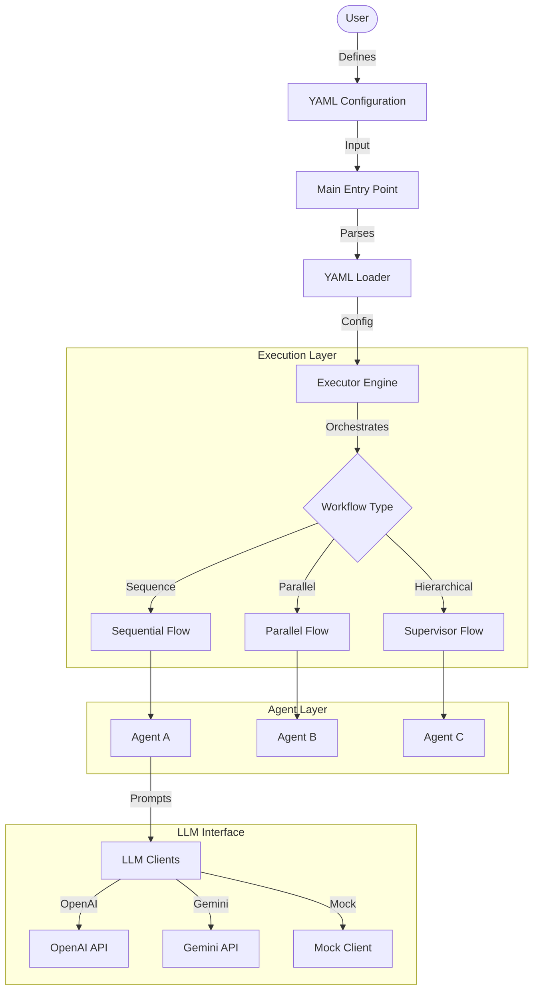

# Declarative Multi-Agent Orchestrator

A lightweight, declarative framework for orchestrating multiple AI agents to complete complex workflows defined in YAML.

## 🏗️ Architecture Design

The system follows a **Declarative Architecture** pattern where the "what" (workflow instructions) is decoupled from the "how" (execution logic).

### Components
1.  **YAML Config**: The single source of truth for agent definitions, roles, tools, and execution flow.
2.  **Executor Engine**: The core processing unit that interprets the YAML and manages the lifecycle of agents and tasks. It handles sequential, parallel, and supervisor-based workflows.
3.  **Agents**: Autonomous entities equipped with a specific role, goal, and set of tools. They interact with the LLM to process inputs and generate outputs.
4.  **LLM Abstraction Layer**: A unified interface to swap between different providers (OpenAI, Gemini) or use a Mock client for testing.

---

## 🔄 Workflow

The end-to-end flow of the solution involves the following steps:

1.  **Configuration**: The user defines the agents (identities, tools) and the workflow steps (execution order) in a configuration file (e.g., `examples/sequential.yaml`).
2.  **Initialization**:
    - The `main.py` script loads the YAML file.
    - It initializes the `LLM Clients` based on environment variables (or Mock mode).
    - It instantiates the `Agents` and registers their tools.
3.  **Execution**:
    - The `Executor` traverses the workflow steps.
    - For each step, it identifies the responsible Agent.
    - It passes the input context to the Agent.
4.  **Agent Processing**:
    - The Agent constructs a prompt based on its system instruction and the current input.
    - It queries the LLM.
    - If the LLM requests tool use, the Agent executes the tool and feeds the result back to the LLM.
5.  **Completion**: The final output is returned to the user or logged.

---

## 🛠️ Technology Stack

| Component | Technology | Justification |
| :--- | :--- | :--- |
| **Language** | **Python 3.13+** | Excellent ecosystem for AI/ML, extensive library support, and strong typing features. |
| **Async Support** | **asyncio** | Essential for handling non-blocking I/O operations, especially when managing multiple parallel agent calls and network requests to LLM APIs. |
| **Config Format** | **YAML** | Human-readable, supporting complex hierarchical data structures perfect for defining agent relationships and workflows. |
| **LLM SDKs** | **OpenAI & Google GenAI** | Native SDKs provide the most robust and up-to-date access to state-of-the-art models (GPT-4o, Gemini 1.5). |
| **Visualization** | **Streamlit** | Provides a rapid way to build interactive data dashboards to visualize logs and agent activities in real-time. |
| **Environment** | **python-dotenv** | Standard practice for managing sensitive configuration like API keys securely. |
